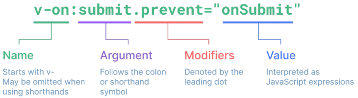

# Vue3_Study
Vue3 정리

[뷰 스타일 가이드](https://ko.vuejs.org/style-guide/)

### 기본 구조

`createApp()` 에 전달되는 객체는 Vue 컴포넌트

컴포넌트의 상태는 `setup()` 함수 내에서 선언되어야 하며 객체를 반환해야 함

### 템플릿 렌더링

Mustache syntax(콧수염 구문) `{{ }}` 를 사용하여 메시지 값을 기반으로 동적 테스트를 렌더링

콘테츠는 식별자, 경로, JavaScript 표현식 사용 가능

## ref : 
state(상태) : -> 자바스크립트 '원시값'을 추척(watch)할 수 있는 객체로 만든다

템플릿에서의 unwrap은 ref가 최상위 속성인 경우에만 적용가능

```jsx
// createApp setup
const message = ref('Im Ref')
console.log(message) // ref 객체
console.log(message.value) // Im Ref

// template
<div>{{message}}</div>
```

## Template Syntax
DOM을 기본 구성 요소 인스턴스의 데이터의 선언적으로 바인딩 할 수 있는 HTML 기반 템플릿 구문을 사용

종류

1. Text Inetpolation
    
    ```jsx
    <p>{{ ref }}</p>
    ```
    
2. Raw HTML
    
    ```jsx
    <div v-html="rawHTML"></div>
    
    const rawHTML = ref('<p style="color:red">HTML Tag 그대로 넘기기</p>')
    ```
    
3. Attribute Bindings
    
    ```jsx
    <div v-bind:class="refClass"></div>
    
    const refClass = ref('클래스이름유동적으로')
    ```
    
4. JavaScript Expressions
    
    ```jsx
    {{ number +1 }}
    {{ ok ? 'yes' : 'no' }}
    {{ msg.split('').reverse().join('') }}
    <div :id="`list-${id}`"></div>
    ```

## Directive : v- 접두사가 있는 특수 속성
[Directive 공식문서](https://vuejs.org/api/built-in-directives.html#built-in-directives)

표현식 값이 변경될 때 DOM에 반응적으로 업데이트 적용



### Argument

일부 directive는 directive 뒤에 `:` 으로 표시되는 인자를 사용 가능

```jsx
<a v-bind:href="myURL">Link</a>

<button v-on:click="doClick">버튼</button>
```

### Modifiers

directive가 특병한 방식으로 바인딩되어야 함을 나타냄

```jsx
//예를 들어 .prevent는 발생한 이벤트에서 event.preventDefault() 호출
<form @submit.prevent="onSubmit">제출</form>
```

## v-bind,v-on,v-model
- v-bind: 하나 이상의 속성 또는 컴포넌트 데이터를 표현식에 동적으로 바인딩
- v-on : DOM 요소에 이벤트 리스너를 연결 및 수신
### 양방향 바인딩
1. v-bind와 v-on을 함께 사용
2. v-model 사용